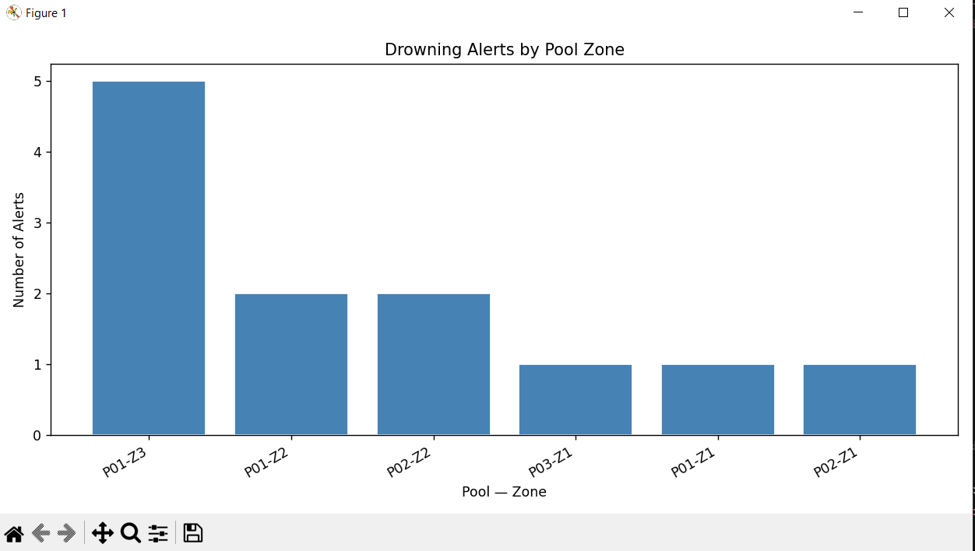
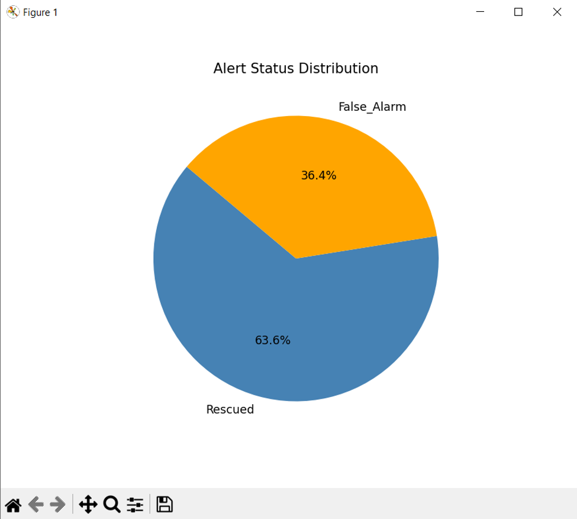
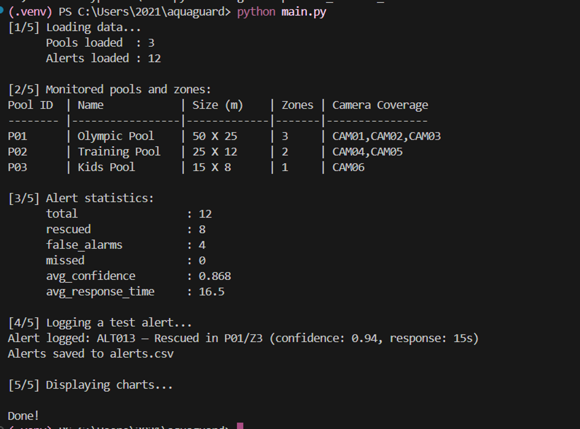

# AquaGuard 

## 1. Student Information

- Name:    Batool Abed
- ID:      202210119
- Project: AquaGuard — Hybrid Intelligent Drowning Rescue System

## 2. Project Overview
quaGuard is a Python-based monitoring system designed to simulate pool safety management.
It processes alert data from swimming pools, analyzes incidents, and provides statistical insights.
The system also visualizes alert distribution across pool zones and status categories to help understand safety patterns.

##  3. How to Run
1. Install requirements
pip install -r requirements.txt

2. Run the main file:
python main.py

## 4. Modules Description

--pool_manager.py
Handles loading and displaying pool configurations and zones from JSON files.

--alert_manager.py
Manages alert data, including loading from CSV, adding new alerts, filtering by zone, and computing statistics.

--visualizer.py
Responsible for data visualization:
1.Bar chart for alerts per pool zone
2.Pie chart for alert status distribution

--main.py
Controls the flow of the application:
1.Loads data
2.Runs analysis
3.Adds test alerts
4.Displays visualizations

## 5. Challenges & Solutions

The matplotlib library was initially installed outside the virtual environment, causing import errors.
Solution: Reinstalled dependencies inside the activated .venv.

## 6. Screenshots

